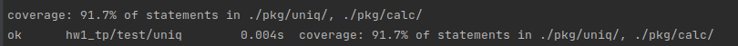

# Домашнее задание 1

### Владислав Ильинский web22 
### Тг https://t.me/Vilin0

## Дисклеймер

## Часть 1. Uniq

Реализован аналог UNIX утилиты `uniq`. 

### Параметры

`-с` - подсчитать количество встречаний строки во входных данных.
Вывести это число перед строкой отделив пробелом.

`-d` - вывести только те строки, которые повторились во входных данных.

`-u` - вывести только те строки, которые не повторились во входных данных.

`-f num_fields` - не учитывать первые `num_fields` полей в строке.
Полем в строке является непустой набор символов отделённый пробелом.

`-s num_chars` - не учитывать первые `num_chars` символов в строке.
При использовании вместе с параметром `-f` учитываются первые символы
после `num_fields` полей (не учитывая пробел-разделитель после
последнего поля).

`-i` - не учитывать регистр букв.

### Компиляция 

mkdir -p bin && go build -o bin/uniq cmd/uniq/main.go

### Использование

C компиляцией:

`./bin/uniq [-c | -d | -u] [-i] [-f num] [-s chars] [input_file [output_file]]`

Или без компиляции:

`go run cmd/uniq/main.go [-c | -d | -u] [-i] [-f num] [-s chars] [input_file [output_file]]`

1.  Поведения утилиты без параметров --
простой вывод уникальных строк из входных данных. По умолчанию входной поток stdin, выходной stdout

### Пример работы

<details>
    <summary>Без параметров</summary>

```bash
$cat input.txt
I love music.
I love music.
I love music.

I love music of Kartik.
I love music of Kartik.
Thanks.
I love music of Kartik.
I love music of Kartik.
$cat input.txt | go run cmd/uniq/main.go
I love music.

I love music of Kartik.
Thanks.
I love music of Kartik.
```

</details>

<details>
    <summary>С параметром input_file</summary>

```bash
$cat input.txt
I love music.
I love music.
I love music.

I love music of Kartik.
I love music of Kartik.
Thanks.
I love music of Kartik.
I love music of Kartik.
$go run cmd/uniq/main.go input.txt
I love music.

I love music of Kartik.
Thanks.
I love music of Kartik.
```

</details>

<details>
    <summary>С параметрами input_file и output_file</summary>

```bash
$cat input.txt
I love music.
I love music.
I love music.

I love music of Kartik.
I love music of Kartik.
Thanks.
I love music of Kartik.
I love music of Kartik.
$go run cmd/uniq/main.go input.txt output.txt
$cat output.txt
I love music.

I love music of Kartik.
Thanks.
I love music of Kartik.
```

</details>

<details>
    <summary>С параметром -c</summary>

```bash
$cat input.txt
I love music.
I love music.
I love music.

I love music of Kartik.
I love music of Kartik.
Thanks.
I love music of Kartik.
I love music of Kartik.
$cat input.txt | go run cmd/uniq/main.go -c
3 I love music.
1 
2 I love music of Kartik.
1 Thanks.
2 I love music of Kartik.
```

</details>

<details>
    <summary>С параметром -d</summary>

```bash
$cat input.txt
I love music.
I love music.
I love music.

I love music of Kartik.
I love music of Kartik.
Thanks.
I love music of Kartik.
I love music of Kartik.
$cat input.txt | go run cmd/uniq/main.go -d
I love music.
I love music of Kartik.
I love music of Kartik.
```

</details>

<details>
    <summary>С параметром -u</summary>

```bash
$cat input.txt
I love music.
I love music.
I love music.

I love music of Kartik.
I love music of Kartik.
Thanks.
I love music of Kartik.
I love music of Kartik.
$cat input.txt | go run cmd/uniq/main.go -u

Thanks.
```

</details>

<details>
    <summary>С параметром -i</summary>

```bash
$cat input.txt
I LOVE MUSIC.
I love music.
I LoVe MuSiC.

I love MuSIC of Kartik.
I love music of kartik.
Thanks.
I love music of kartik.
I love MuSIC of Kartik.
$cat input.txt | go run cmd/uniq/main.go -i
I LOVE MUSIC.

I love MuSIC of Kartik.
Thanks.
I love music of kartik.
```

</details>

<details>
    <summary>С параметром -f num</summary>

```bash
$cat input.txt
We love music.
I love music.
They love music.

I love music of Kartik.
We love music of Kartik.
Thanks.
$cat input.txt | go run cmd/uniq/main.go -f 1
We love music.

I love music of Kartik.
Thanks.
```

</details>

<details>
    <summary>С параметром -s num</summary>

```bash
$cat input.txt
I love music.
A love music.
C love music.

I love music of Kartik.
We love music of Kartik.
Thanks.
$cat input.txt | go run cmd/uniq/main.go -s 1
I love music.

I love music of Kartik.
We love music of Kartik.
Thanks.
```

</details>


## Часть 2. Calc

Написал калькулятор, умеющий вычислять выражение, подаваемое на STDIN.

Реализованы сложение, вычитание, умножение, деление и поддержку скобок. Только бинарные операторы

### Пример работы

```bash
    $ go run cmd/calc/main.go "(1+2)-3"
    0
```
### Тестирование

`mkdir -p bin && go test -v  -coverprofile=bin/cover.out ./pkg/... && go tool cover -html=bin/cover.out -o=bin/cover.html
`


